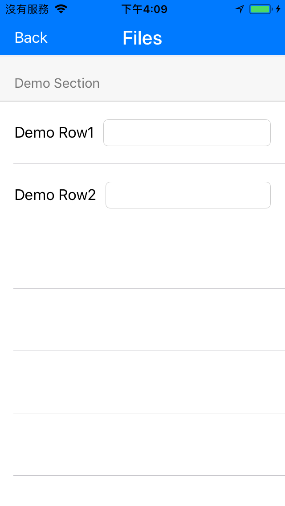

# IRCollectionTableViewModel-swift 

- IRCollectionTableViewModel-swift is a powerful MVVM Tableview/CollectionView for iOS, which is flexible and can easy to handle and reuse.
- The Objc version [IRCollectionTableViewModel](https://github.com/irons163/IRCollectionTableViewModel).

## Features
- MVVM structure.
- Flexible, Reusable.

## Install
### Git
- Git clone this project.
- Copy this project into your own project.
- Add the .xcodeproj into you  project and link it as embed framework.
#### Options
- You can remove the `demo` and `ScreenShots` folder.

### Cocoapods
- Add `pod 'IRCollectionTableViewModel-swift'`  in the `Podfile`
- `pod install`

## Introduction MVVM

- Model--view--viewmodel (MVVM) is a software architectural pattern.
- It has advantages more than the tranditional MVC architectural. Can improve the whole code strurcture.
- More detail can see the MVVM wikipedia. [MVVM](https://en.wikipedia.org/wiki/Model–view–viewmodel)

## Usage

### Basic

#### TableView

- Create a new class `TableViewViewModel` extends `TableViewBasicViewModel` and `UITableViewDataSource`, and Import `IRCollectionTableViewModel-swift`
```swift
import IRCollectionTableViewModel_swift

class TableViewViewModel: TableViewBasicViewModel, UITableViewDataSource {
    ...
}
```

- You can add your init method and register the cell inside

```swift
init(tableView: UITableView) {
    super.init()
    items = []
    
    tableView.register(UINib.init(nibName: TableViewCell.identifier(), bundle: nil), forCellReuseIdentifier: TableViewCell.identifier())
}
```

- Add  `update` method
```swift
func update() {
    items.removeAll()
    self.setupRows()
}
```

- For setup `items`, other words, setup the sections/rows you want to show. Create `TableViewSectionItem`  and `TableViewRowItem`, `DemoSectionType`, `DemoRowType`
```swift
enum TableViewSectionType: NSInteger {
    case DemoSection
}

internal enum ProfileRowType : NSInteger {

    case RowType_DemoRow
}

class TableViewRowItem: RowBasicModelItem {
    var newType: ProfileRowType = .RowType_DemoRow
    override public var type: ProfileRowType.RawValue {
        set {
            self.newType = ProfileRowType(rawValue: newValue)!
        }
        get {
            return newType.rawValue
        }
    }
    
    override init(type: RowType, title: String) {
        super.init(type: type, title: title)
    }
}

class TableViewSectionItem: SectionBasicModelItem {
    private var _sectionTitle: String?
    private var _type: TableViewSectionType = .DemoSection
    
    override init(rowCount: UInt) {
        super.init(rowCount: rowCount)
    }
    
    override func sectionTitle() -> String? {
        return self._sectionTitle
    }
    
    open func sectionTitle(_ sectionTitle: String) {
        self._sectionTitle = sectionTitle
    }
    
    override func type() -> SectionType {
        return self._type.rawValue
    }
    
    open func type(_ type: TableViewSectionType) {
        self._type = type
    }
}
```

- Setup `items`
```swift
func setupRows() {
    var rowItems: [RowBasicModelItem] = []
    rowItems.append(TableViewRowItem.init(type: ProfileRowType.RowType_DemoRow.rawValue, title: "Demo Row"))
    rowItems.append(TableViewRowItem.init(type: ProfileRowType.RowType_DemoRow.rawValue, title: "Demo Row"))
    editedTexts = []
    for _ in rowItems {
        editedTexts.append("")
    }
    
    let item = TableViewSectionItem.init(rowCount: UInt(rowItems.count))
    item.type(.DemoSection)
    item.sectionTitle("Demo Section")
    item.rows = rowItems
    self.items.append(item)
}
```

- Override `UITableViewDataSource`
```swift
// MARK: - UITableViewDataSource
    func numberOfSections(in tableView: UITableView) -> Int {
        return items.count
    }
    
    func tableView(_ tableView: UITableView, numberOfRowsInSection section: Int) -> Int {
        return items[section].rowCount()
    }
    
    func tableView(_ tableView: UITableView, cellForRowAt indexPath: IndexPath) -> UITableViewCell {
        let item = items[indexPath.section]
        let row = item.rows[indexPath.row]
        
        switch row.type {
        case ProfileRowType.RowType_DemoRow.rawValue:
            do {
                let cell: TableViewCell = tableView.dequeueReusableCell(withIdentifier: TableViewCell.identifier(), for: indexPath) as! TableViewCell
                cell.titleLabel.text = String.init(format: "%@%ld", row.title!, row.tagRange.location)
                cell.editTextField.text = self.editedTexts[indexPath.row] as String
                cell.editTextField.tag = row.tagRange.location
                cell.editTextField.delegate = self
                return cell
            }
        default:
            break
        }
        return UITableViewCell.init()
    }
```

- Use your view model `TableViewViewModel`
```swift
var viewModel: TableViewViewModel?

self.tableView.register(UINib.init(nibName: TableViewHeaderView.identifier(), bundle: nil), forHeaderFooterViewReuseIdentifier: TableViewHeaderView.identifier())
viewModel = TableViewViewModel.init(tableView: self.tableView)
self.tableView.dataSource = viewModel
viewModel!.update()
```

#### CollectionView

- Just the same way of `TableViewViewModel`. Create a new class `CustomCollectionViewModel` extends `TableViewBasicViewModel` and `UICollectionViewDataSource`.

- You can add your init method and register the cell inside.

- For setup `items`, other words, setup the sections/rows you want to show. Create `CustomCollectionSectionItem`  and `CustomCollectionRowItem`, `CustomCollectionSectionType`.

- Override `UICollectionViewDataSource`.


### Advanced settings

#### Methos of TableViewBasicViewModel

- `TableViewBasicViewModel` provides some usage methods

```swift
// MARK: - Public
public func getRowTypeWith(type: SectionType, row: NSInteger) -> NSInteger
public func getSectionTitleinSection(section: NSInteger) -> String?
public func getSectionLeftIconinSection(section: NSInteger) -> UIImage?
public func getSectionTypeinSection(section: NSInteger) -> SectionType
public func hideRows(hide: Bool, inSection section: NSInteger)
public func hiddenRowsinSection(section: NSInteger) -> Bool
public func getIndexSetWithSectionType(sectionType: SectionType) -> NSIndexSet?
public func getIndexPathWithSectionType(sectionType: SectionType, rowType: RowType) -> NSIndexPath?
public func setupRowTag()
public func getIndexPathFromRowTag(rowTag: NSInteger) -> NSIndexPath
```
#### Tag

- Because the cells have reuse feature, somtimes we need to tag the cell/componenst if want to recognize the specific cell/components, thus  `IRCollectionTableViewModel` provides a tag feature

- Setup tags by `setupRowTag`, it save the tag information in the `tagRange` which is in the `RowBasicModelItem`
```swift
- (void)setupRows {
    ...
    
    self.setupRowTag()
}
```

- Get tag
```swift
let row = item.rows[indexPath.row]
let tag = row.tagRange.location
```

- Get indexPath by tag
```swift
public func getIndexPathFromRowTag(rowTag: NSInteger) -> NSIndexPath
```

- Sometimes you want to tag the UI components like `UITextField`, use `setTagRangeLength`
```swift
var row = TableViewRowItem.init(type: ProfileRowType.RowType_DemoRow.rawValue, title: "Demo Row")
row.setTagRangeLength(2)

...

self.setupRowTag()
```

- Then get tags
```swift
let row = item.rows[indexPath.row]
let tag1 = row.tagRange.location
let tag2 = row.tagRange.location + 1

cell.textField1.tag = tag1
cell.textField2.tag = tag2
```

- If you wnat to check the tags are mapping to the same index path
```swift
self.getIndexPathFromRowTag(tag1) == self.getIndexPathFromRowTag(tag2)
```

Now, you can easy to tag anyhing you want.


#### Get Row Type

- Get row type

```swift
self.getRowTypeWith(type: 0, row: 0)
```

#### Get Section Title

- Get section title which set in the `SectionBasicModelItem`

```swift
self.getSectionTitleinSection(section: 0)
```

#### Get Section Left Icon

- Get section icon which set in the `SectionBasicModelItem`

```swift
self.getSectionLeftIconinSection(section: 0)
```

#### Get Section Type

- Get section type by section index

```swift
self.getSectionTypeinSection(section: 0)
```

#### Hide Rows

- Hide rows for specific setion by `public func hideRows(hide: Bool, inSection section: NSInteger)`
- Check hidden status by `public func hiddenRowsinSection(section: NSInteger) -> Bool`

```swift
if self.hiddenRowsinSection(section: 0) {
    self.hideRows(hide: false, inSection: 0)
}
```

#### Get Index Set

- Get index of section by section type

```swift
self.getIndexSetWithSectionType(sectionType: .DemoSection)
```

#### Get IndexPath

- Get index path by section type and row type

```swift
self.getIndexPathWithSectionType(sectionType: .DemoSection, rowType: .RowType_DemoRow)
```


## Screenshots
| TableView | CollectionView |
|:---:|:---:|
||| 
